
# a14g-final-submission

    * Team Number: 07
    * Team Name: Studying Team
    * Team Members: Guanlin Li, Xinmi Wang
    * Github Repository URL: https://github.com/ese5160/a14g-final-submission-s25-t07-studying-team
    * Description of test hardware: Laptop

## 1. Video Presentation

<iframe width="560" height="315" src="https://www.youtube.com/embed/FkS4sQEOVI0" frameborder="0"
allow="accelerometer; autoplay; clipboard-write; encrypted-media; gyroscope; picture-in-picture"
allowfullscreen></iframe>

Or you can check the video [HERE](https://drive.google.com/file/d/1UU-8aRGXkOOEAa9cYBTTbaUJIwjn4cNM/view?usp=sharing). 

## 2. Project Summary

### Device description

This device is a force-feedback knob that should be able to imitate the feeling of a mechanical knob, including level-devided knob, level-less knob, and limitation of knobs. The user should be able to send the data of the knob to the node-red so that it could control other devices, such as temperature, volume, and all other stuffs that could be adjusted using a knob. 

This project is inspired by an online project that uses a brushless dc motor to provide force-feedback to a knob. Using the motor, the knob could give different force-feedback to the user, making the knob highly adjustable. 

The knob could be used as a central control for in-home smart device control. For example, it could set the desired temperature using the knob, which could give a level-devided feeling to the user when they choose between each level of temperature. In detail, if the user wishes to spin the temperature from 70F to 71F, they will feel the force that tries to move the knob back to 70F before they reached the midpoint between these two temperature, and the force that spins towards 71F when they go pass the midpoint. Also, we can set a boundary where the knob will always tries to move back if the user spins out of bound. For example, if the upper bound is 80F, then the knob will always try to return to 80F if the user spins it beyond 80F. 

The internet is an important part to our project, as the knob needs to send the current readings to different devices in order to control them. Therefore, we need to send the current mode, the button status, and the readings to node-red using MQTT so that the user could use them as they wanted. 

### Device functionality

The device is designed in a problem-solving based thinking. We have a lot of devices that could use a spinning knob to control in home. For example, we could use a knob to control the desired temperature, the volume of our sound bar, the fan speed, the brightness and temperature of the lamp, and a lot more, for example, switching devices on/off. The current smart home controller uses a spinning knob to control all of these, but there are no force-feedback, meaning sometimes user could accidentally spin over the desired numbers. With force-feedback, we could imitate the feeling of a mechanical knob, so when the user spins the knob, he/she could feel that the knob is currently in a level or at the limit, so they don't need to control their hand movement precisely to spin the knob to their desired value. 

Based on this idea, we started designing our project. To achieve a force-feedback knob, we decided to put a motor and an encoder so that the motor could provide force-feedback, and the encoder should be able to tell the system where the motor has spun to. This gives a close-loop control on the motor. The LCD screen is also included to provide a visual feedback on what mode the user is currently in and what value did the user spin to. The LEDs are designed to provide a clear feedback of whether the user pressed the button or not. 

This is our system-level block diagram. 

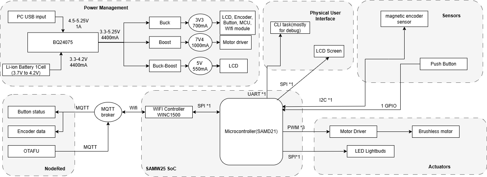

### Challenges

There are all kinds of challenges that we faced. The first one is the driver for the LCD screen and the motor. Since our project is using C and there's no library for the motor and the LCD screen that writes in C, we have to make our own library. We checked different datasheets and examples and we finally figured out how to initialize and send data/commands the LCD screen. However, we were unable to fully control the motor at the end. We were also not sure where the motor went wrong, since our code matches the workflow of FOC control. Therefore, the spring-like motor will be the only mode we could demonstrate. We will work on this motor during the summer and hopefully we could figure out a way to control it. 

The second challenge is from our hardware manufacturer. When our boards arrived, the 7V4 on all three of the boards are not working. We used the oscilloscope to check the output of the 7V4, and we found that the chip is trying to power up but immediately entered protect mode that reset the chip and output. We then probed voltages across the converter and finally discovered that the voltage at the feedback is not correct - it should be around 1.2V as the reference voltage should be, but it rises all the way to 2.5V. We then probed the resistance of the two resistor that forms the voltage devider of the feedback end, and discovered that the manufacturer accidentally swapped the two resistor, causing abnormal voltage at the feedback pin. The 7V4 functions as expected after we swapped the two resistors back. 

We also found a channel conflict when we are trying to wrap everything up. The WiFi module on the chip uses SERCOM2 to communicate with the MCU. However, the LED and the I2C sensor also requires SERCOM0/SERCOM2. Therefore, we only have 2 channels available while we have 3 devices that needs to use them. This was discovered only several hours before the demo, so we were unable to fix this issue. If more time were given, we could probably find spare pins that uses other SERCOM and connect it to the LED signal jumper, thereby resolve this issue. 

During the integration, we also found that the LCD signal cannot be derived from the MCU. This stops our LCD from displaying the data that we need to show to the user in order to provide any visual feedback. We have no time to address this, although we tried to scrape off the cover of the output line and weld an enameled wire from it to connect to our logic analyzer. We speculate that there might be some connection problem from the MCU to the board, or there might be software problems that redefined the mode of the MOSI line.

### Prototype learnings

We learned alot when assembling our prototype and testing it. For example, we learned that if the power regulator is not working, we should first connect an oscilloscope to it and check the output of it. If we see that the regulator is struggling to power up and put back into protection mode immediately, there could be something to do with the feedback voltage. 

Also, we should test everything on the dev board before making the PCB. The course is kind of rush so we have no time to validate our idea, therefore, we were not able to accomplish our target and there are mistakes discovered later that could be prevented if we validate it beforehand. 

If we can start it over again, we would probably first validate the motor to see if it could work. We spend excessive time on the motor driver but were unable to bring a satisfying driver at the end. Also, we would prevent the use of SERCOM2 for the LED signal pin by changing the pin to other pin that uses SERCOM1 for example. Also, we would move the LCD screen's connector closer to the MCU so that it won't be interfered by other noisy signals. We also connect the wrong pin for the LCD screen (MOSI and SCLK on the wrong pad of SERCOM2). We would also adjust this one if possible. 

### Next steps & Takeaways

A working motor driver is needed to finish this project. Currently, we are not able to fully control the motor. Also, we need to make the LCD screen of the device working. Currently, the LCD screen is not working due to unknown reason, and we wish to find out the reason behind it. 

A main thing we learned in this course is to validate the idea and driver for every part in the project before actually build the PCB board. Personally for me (Guanlin), I think the most interesting part in this course is about the bootloader. I always heard this part during my projects, online resources, and even in 5190, but this is the first time I actually write a bootloader that updates my firmware. I learned alot during the implementation of the bootloader. 

### Project links

Node-Red link: [CLICK HERE](http://172.178.40.121:1880/#flow/9ecac7261ee87947)

Node-Red UI: [CLICK HERE](http://172.178.40.121:1880/ui/#!/0?socketid=yH4iVXIwXRf_c1zhAAAJ)

Altium link: [CLICK HERE](https://upenn-eselabs.365.altium.com/designs/2CB5A97B-359C-4D7A-BC51-302EB17B2030#design)

## 3. Hardware & Software Requirements

### Hardware Requirements:

#### HER01: The screen shall react to user's input on the knob and the pushbutton by displaying corresponding user interfaces.

This requirement was not fulfilled in the current implementation. Although the LCD was intended to display real-time feedback — specifically, showing the current angular position of the knob using a rotating pointer and the current mode it is in, no signal was detected on the SDA (MOSI) lines, indicating a failure in SPI communication with the display. Due to tight time constraints, we were unable to fully investigate the issue. We suspect a hardware connection fault or a software SERCOM/pin mapping conflict. As a result, the LCD remained non-operational during the demo and will be revisited in future work. 

#### HRS02: The knob shall react to user's input on the knob by applying force on the knob via the brushless motor.

The knob currently behaves like a virtual spring, offering force feedback when rotated and released. This confirms that basic motor control and force application are working. However, we have not yet implemented programmable dynamic force profiles or feedback modes, which limits the extent of haptic interaction. Validation was done by rotating the knob and observing the spring-like behavior restored by the motor. The motor will always rotate back to the preset position no matter what direction it is spun to. 

#### HRS03: The device shall be able to last for at least 2 hours with DC power disconnected.

With the motors continuously powered, the system operates for approximately 1 hour and 30 minutes on battery. This falls short of the 2-hour target. We measured the run-time by fully charging the battery, disconnecting external power, and timing until the motor could no longer be powered by the driver effectively. Reducing motor activity or optimizing sleep modes may help reach the target in future iterations. 

#### HRS04: The LEDs shall react to user's input on the knob and the pushbutton.

The LED system successfully responds to user inputs. For instance, pressing the knob changes the LED color, indicating that the system is receiving and processing input signals correctly. We validated this by pressing the button multiple times and observing corresponding LED color changes. We could expand the color of the LED corresponding to different modes in future works. 

#### HRS05: The magnetic encoder sensor shall be used to detect the angle which the knob has spun to within 5 degrees.

Status: Met

We validated the accuracy of the magnetic encoder by comparing its digital output to known angular displacements. The encoder outputs a 12-bit value ranging from 0 to 4095, corresponding to a full 360° rotation.

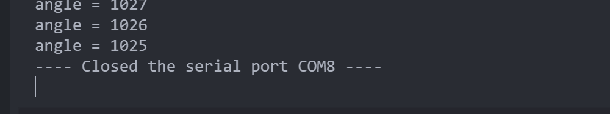

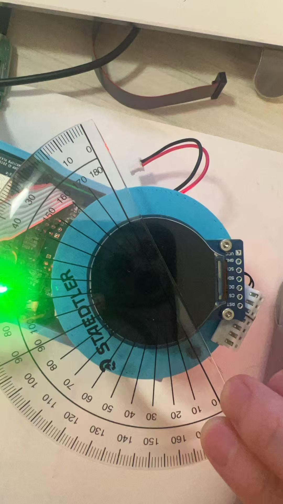

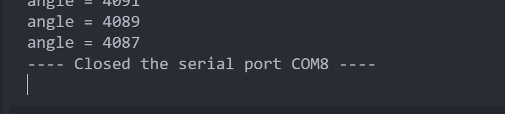

In one test, we rotated the knob approximately 90 degrees. The initial reading was 4088, and the final reading was 1025. Accounting for rollover, the calculated angle was:((1025−0+1)+(4096−4088+1))/4096×360=90.97 ∘

This is within 1 degree of the expected value.

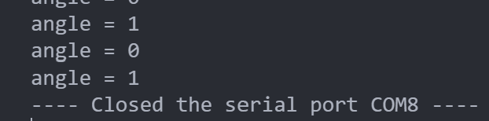

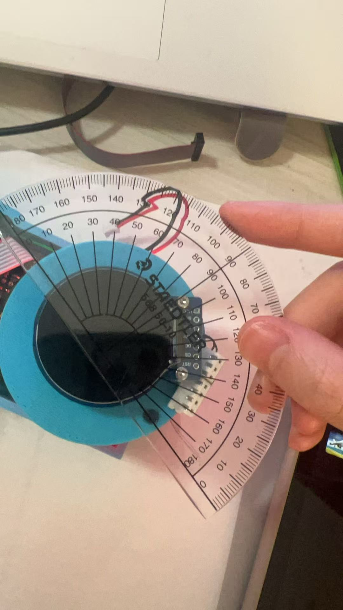

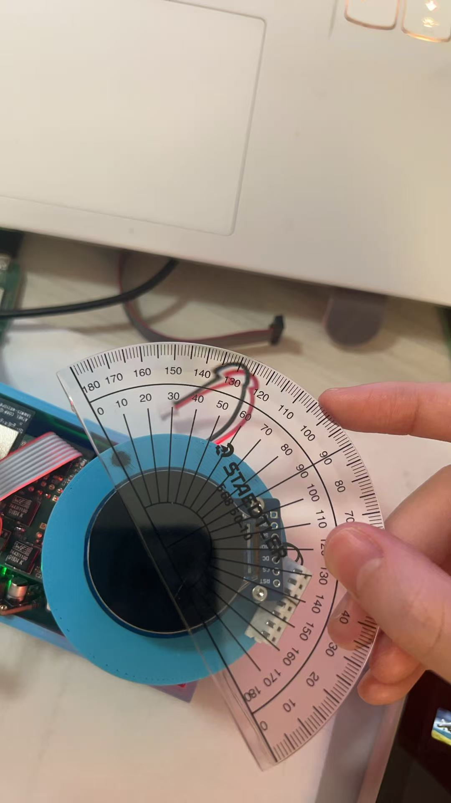

In another test, we rotated the knob approximately 180 degrees. The initial reading was 0, and the final reading was 2038. The calculated angle was:(2038−0+1)/4096×360=179.12∘
 
Again, this is within 1 degree of the expected angle. These results confirm that the sensor reliably detects rotational angles with better than 5-degree accuracy.

### Software requirements:

#### SRS 01: The system will detect rotation and push inputs from the knob with high precision, using the magnetic encoder to update the state at least every 10 milliseconds.

The system reads encoder data at 1k Hz using a FreeRTOS task. Real-time debugging logs confirmed that encoder values were updated every 1 milliseconds, depending on system load. Both rotation and pushbutton inputs are successfully detected and debounced, ensuring precise interaction tracking. 

#### SRS 02: The software will control the LED output to change colors corresponding to different modes activated via the knob interface, using predefined color codes.

Initially, the plan was to assign specific LED colors to indicate different control modes. However, due to time constraints and the shift in design, the system now relies on feedback to determine LED behavior. The LED responds when the knob is pressed, reflecting button status rather than control mode. This is considered a minor requirement and was partially implemented in the final prototype. This could also be easily adjusted as the driver for the LEDs are already implemented and a function call with the desired color as parameter could adjust the color. 

#### SRS 03: Communication with other smart devices will utilize MQTT for sending and receiving commands over Wi-Fi.

Although we originally intended to control external smart devices (e.g., thermostat, lamps lignting, volume control) via MQTT as the final demonstration, time constraints prevented full implementation. Instead, the system focuses on reliably publishing angular position and button status to Node-RED using the MQTT protocol. No actual devices are controlled in this version, but the data pipeline is functional and ready for extension. The devices could simply subscribe to the topic on the MQTT broker and would be able to acquire full information of the knob. 

#### SRS 04: The LCD display will update user interface elements in real-time to reflect changes made through the knob, supporting dynamic updates without lag.

SDA signal line is found non-functional by observing the salae logic analyzer output. possibly due to routing or pin assignment failure on the board. However, the driver for the LCD screen and the task for the LCD screen is implemented. The LCD could be brought back online easily once the real problem is pinpointed in the future. 

## 4. Project Photos & Screenshots

Thermal camera images while the board is running under load

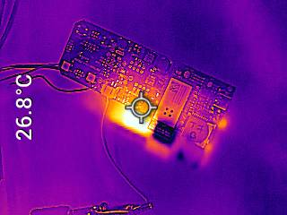

stand alone PCB top:

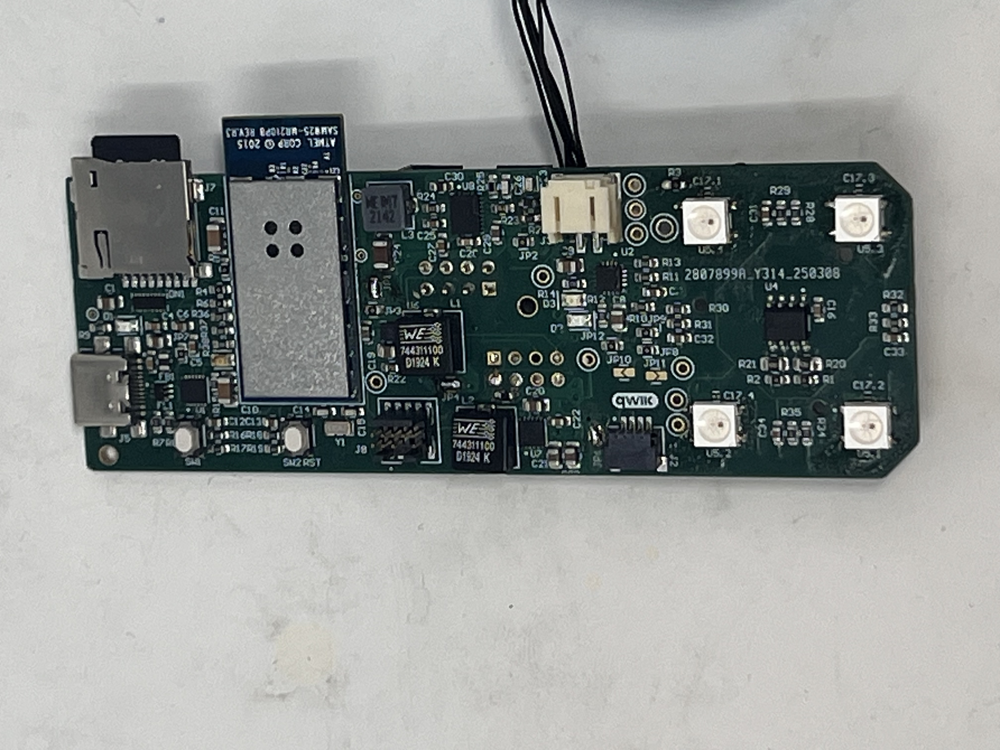

The standalone PCBA, bottom:

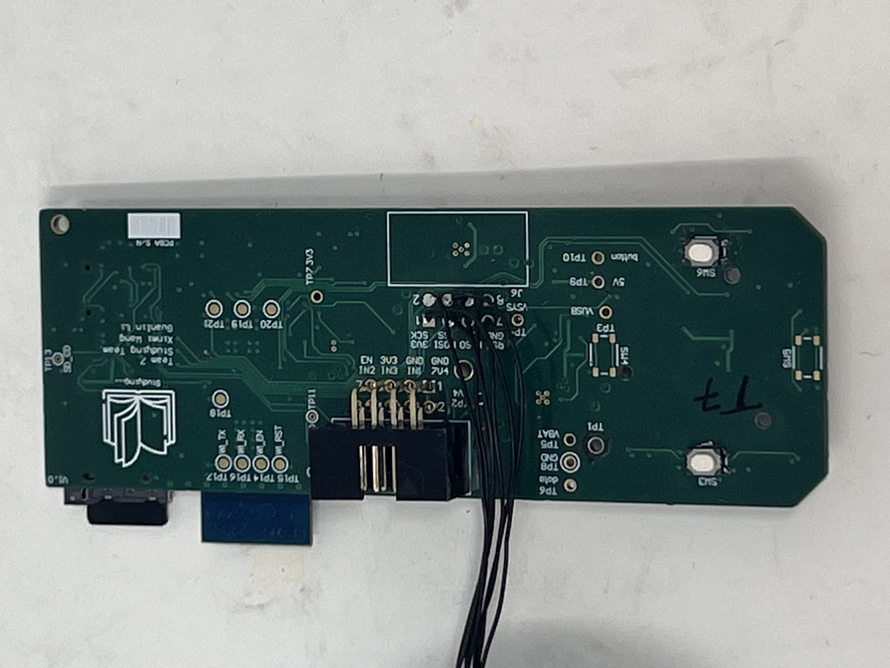

Node-RED backend

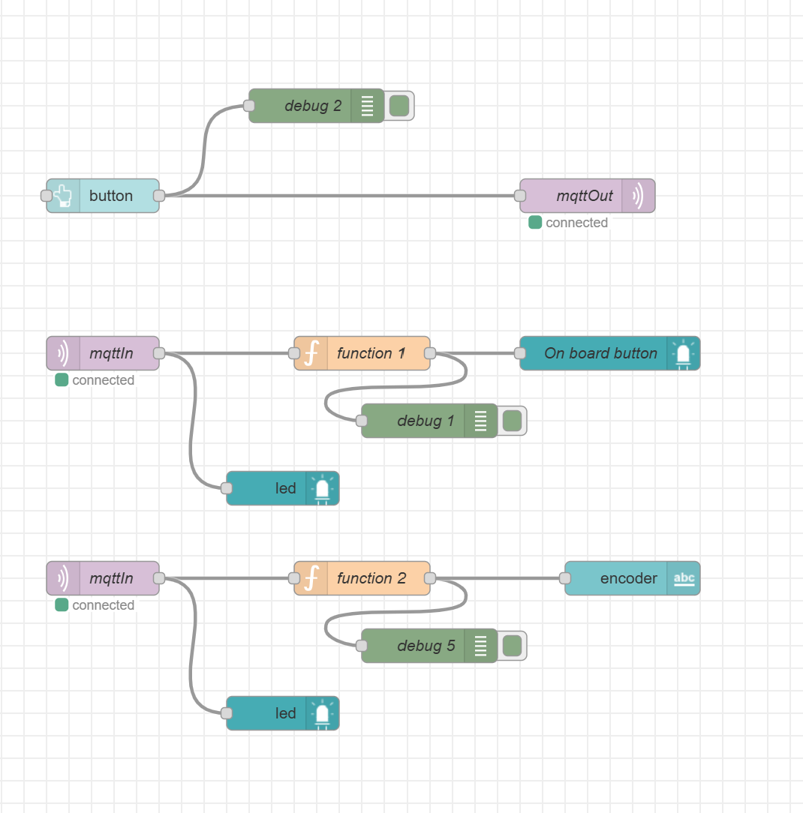

Node-RED dashboard

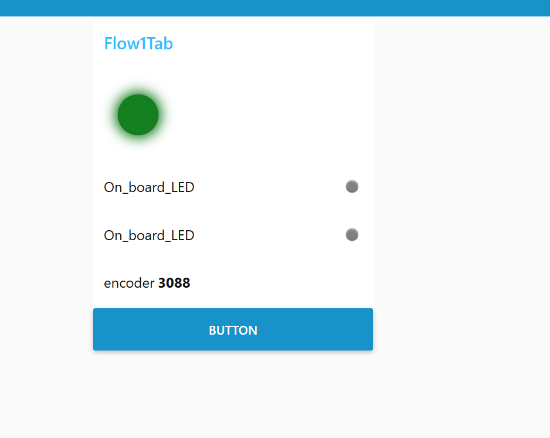

The Altium Board design in 2D view

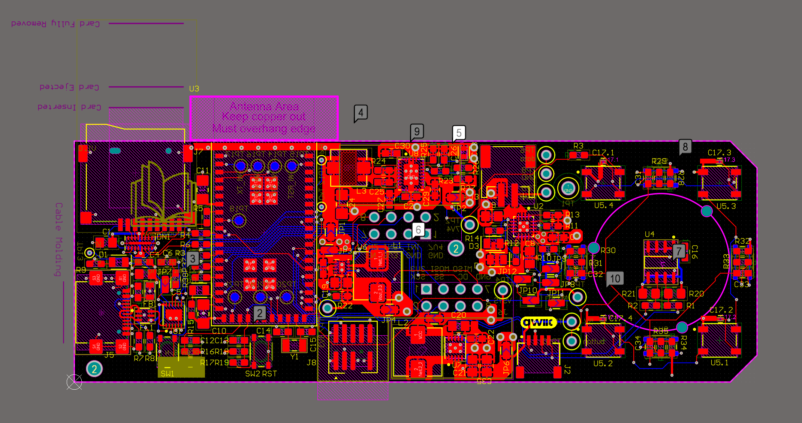

The Altium Board design in 3D view

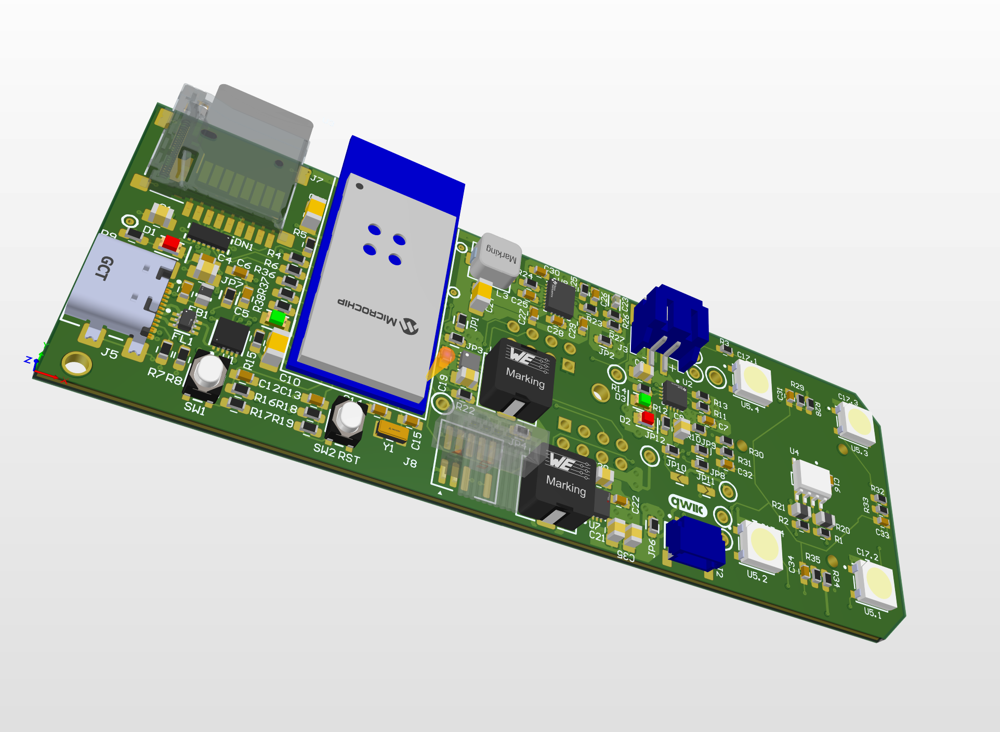

Block diagram of your system:

## Codebase

Node-Red link: [CLICK HERE](http://172.178.40.121:1880/#flow/9ecac7261ee87947)

Firmware link: [CLICK HERE](https://github.com/ese5160/final-project-t07-studying-team)